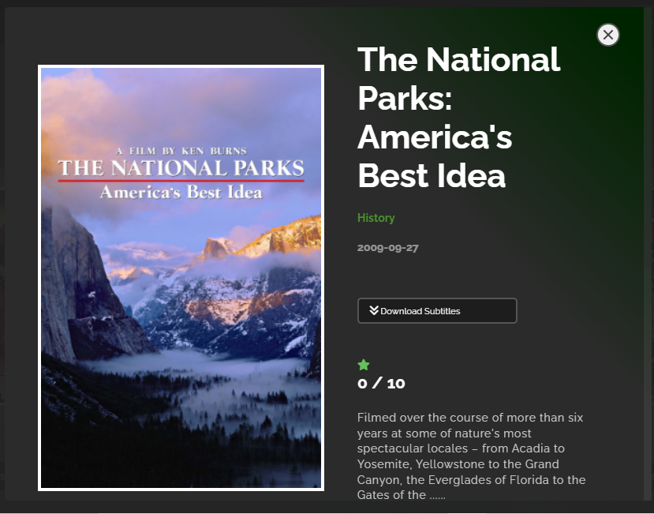

## Preview

Home page

<h1 align="center"> ShowMax Movies </h1>

> Here you can access the list of lovely movies, like your favourite movie and leave your comments for your movie in the comment section.

## Built With

- **HTML** and **CSS** and **Javascript**

## DEMO

[See Live Link](https://mikelobi.github.io/Showmax-Movies/dist)

## Video Description

- [Project Presentation](https://www.loom.com/share/3ca40a5bbef1436abcd76b76cd62ddc1)

### Setup

- Simply fork this project
- run `npm install `to install all dependencies
- run `npm run build` to bundle the project with webpack, and
- run `npm start` to launch the application

## Authors

👤 **Michael Ugochukwu**

- GitHub: [Mikelobi](https://github.com/Mikelobi) 
- Twitter: [Mikelobi](https://twitter.com/omulum)rold
- LinkedIn: [Mikelobi](https://linkedin.com/in/ugochukwu-omulu-b9697663)

👤 **Harold Mudosa**

- GitHub: [Harold](https://github.com/haroldmud)
- Twitter: [Harold](https://twitter.com/MudosaHarold)
- LinkedIn: [Harold](https://linkedin.com/in/haroldmudosa
)

## 🤝 Contributing

Contributions, issues, and feature requests are welcome!

Feel free to check the [issues page](https://github.com/Mikelobi/Show-Movies/issues).

## Show your support

Give a ⭐️ if you like this project!

## Acknowledgments

My appreciation to all who contributed to this wonderful project. A special thanks to `Tvmaze.com` and `Involvement API` for rendering public API consumption. 

## 📝 License

This project is [MIT](https://opensource.org/licenses/MIT) licensed.